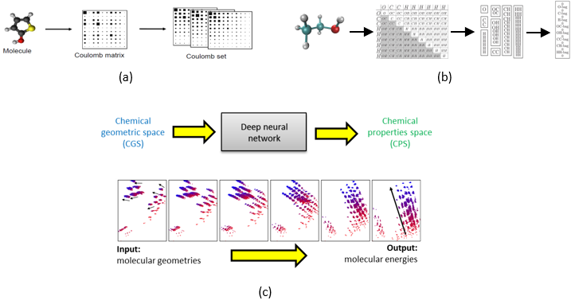

## Effeciently Approximating Chemical Properties via Deep Learning (Master's thesis)

The accurate and efficient prediction of molecular properties throughout chemical compound space is a critical ingredient towards rational compound design in chemical and pharmaceutical industries. 
In this work, I have evaluated number of well established deep learning methods to predict the quantum-mechanical molecular properties directly from a raw molecular geometry. Following which the influence of these methods on various molecular representations are examined. Finally, bayesian optimization methods are explored to fine tune the hyper parameters. 

  
   
  <em>Fig 1: (a) Coloumb matrix representation (b) Schematic view of Bag of Bonds (BoB) representation (c) Transparency of the deep neural network while predicting molecular properties.
  </em>

Through this work, I have demonstrated that deep learning methods can be successfully applied to accuractely and efficiently predict molecular properties in chemical cound space. Also, I have set a new benchmark accuracy for some of the molecular properties and reported novel results using new and large datasets.

V. Rajendran: Efficiently Approximating Chemical Properties via Deep Learning, Master's thesis, Technical Universty of Munich, April 2016.<a href="https://drive.google.com/open?id=0B0rphpME2J_raWRVSHZXcjItNW8">[pdf]</a> <a href="https://drive.google.com/open?id=0B0rphpME2J_rTmlKcmRNS2xUU2s">[ppt]</a>

## Music Genre Classification with the Million Song Dataset

Musical genres have no strict definitions and boundaries as they are formed through a complex interaction between the public, marketing, historical, and cultural factors. This makes multiclass music
genre classification a difficult process. In this work, each song only has one genre label. In reality, assigning just one genre to a song can be more challenging when there is some degree of possible overlap between certain genres. In this work, I have built a music genre classification using both audio features and lyrics sentiment features. In addition, a classification model with only audio features as well as lyrics sentiment features are experimented. This involves the tasks such as data merging , data cleaning, reducing tags via clustering, feature extraction and model selection. 

  
   
  <em>Fig 2: Reduced dataset with 10 music genres
  </em>

I could able to achieve 68.11% accuracy using only audio features. It was considered to be 2.28% higher than the one reported in 12th ISMIR 2011 (recent work at that time). 

V. Rajendran: Music Genre Classification,Advanced Data Mining Lab Course, April 2015.<a href="https://drive.google.com/open?id=0B0rphpME2J_rZDRaUjNoeDdmcEU">[ppt]</a>

## Research seminar on natural language processing in relation to legal tasks

Techniques of natural language processing(NLP) have been
under development since the earliest computing machines, and in recent years these techniques have proven to be robust, reliable and efficient enough to lead to commercial products in many areas. The applications include machine translation, word processing, information management, dialogue systems and email understanding but NLP techniques have also been applied to other computing tasks besides these. In this seminar, I presented a concise overview on some of the basic NLP techniques used in Information retrieval systems along with their potentials and ambiguities with respect to English language. Following which the applications of NLP in legal domain are discussed. In particular, text classification and text summarization in legal retrieval system along with their approaches and challenges faced are presented.

  
   
  <em>Fig 3: (a) Text classification and (b) Text summarization in legal retrieval system
  </em>

V. Rajendran: Information Retrieval: Natural Language
Processing, Research Seminar on NLP, Technical Universty of Munich, April 2016.<a href="https://drive.google.com/open?id=0B0rphpME2J_rNmRlb091QlRqRHM">[pdf]</a><a href="https://drive.google.com/open?id=0B0rphpME2J_rZUpuTm5yOFd6NTQ">[ppt]</a>
